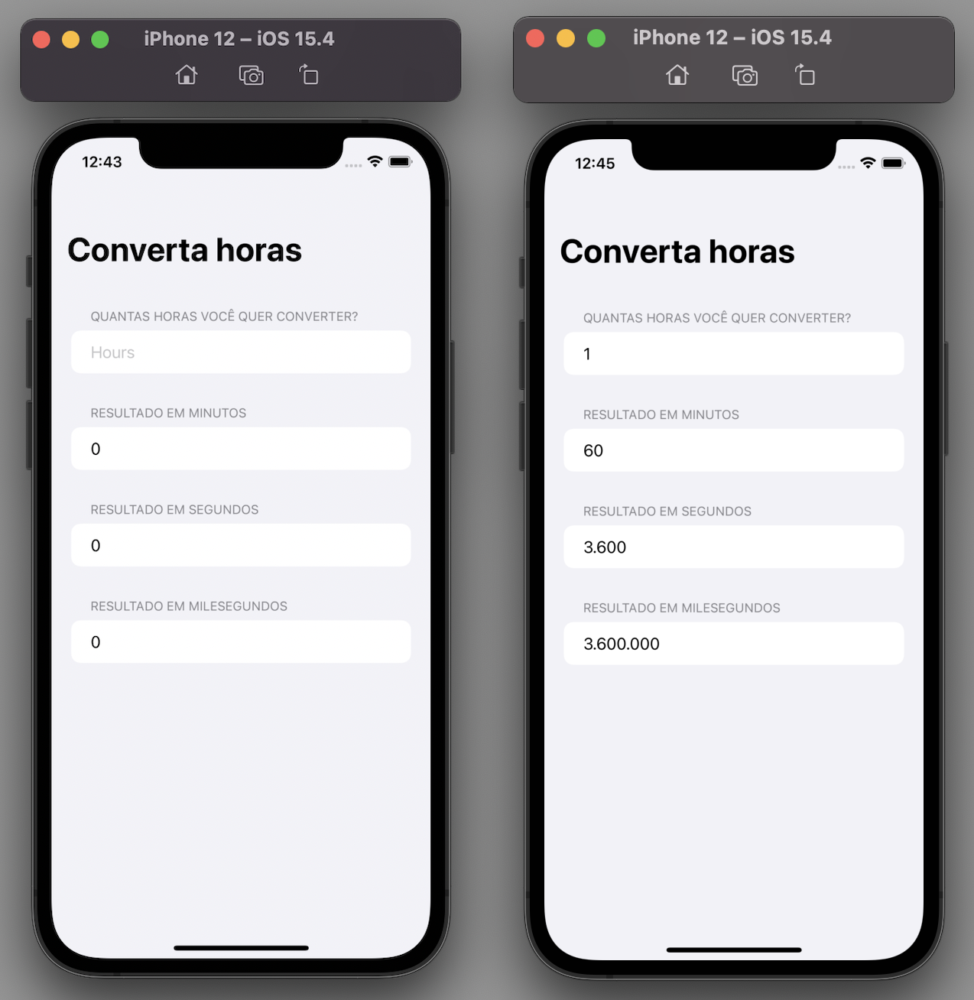

# ConvertHours

A project to help convert hours in minutes, seconds or millisecond.

## Project

This project was developed using SwiftUI.

To start, I used a struct with all the rules to convert.

So in the View I used Navigation View with Form. 

Inside Form, I added a section that contains header: Text and text field for the user to enter a number. And other three sections that show the results.

There is a navigationTitle at the top of the screen.

**Learning about: SwiftUI, Xcode, View, NavigationView, Struct, Form, Section, and more.**

##
*This project was developed during the study.*
